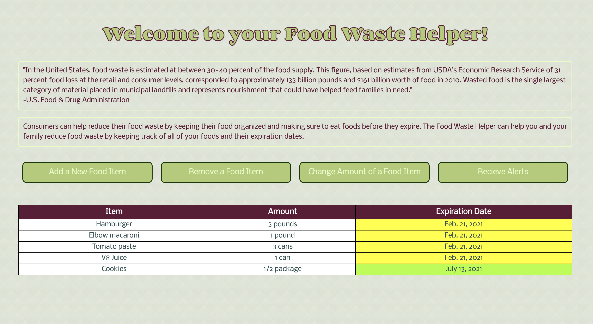

# Food Waste Helper
> Takes user input and creates a table of food items, their amounts, and their expiration dates that can be removed, added, and adjusted by the user. The table is organized with the earliest expiration dates at the top, along with a special color-coding to further organize expiration dates. Red means expired, yellow means expiring in a week, and green means over a week until the expiration date.

## Table of contents
* [General info](#general-info)
* [Screenshots](#screenshots)
* [Technologies and Languages](#technologies)
* [Features](#features)
* [Status](#status)
* [Inspiration](#inspiration)
* [Collaborators](#contact)

## General info
Food waste by consumers is a large portion of all food waste. We wanted to create an application to help reduce food waste at the consumer level by giving consumers an easy tool to keep track of expiration dates.

## Screenshots

## Technologies and Languages
* Django
* Python
* CSS
* HTML

## Features
List of features ready and TODOs for future development
* Add and delete pantry items
* Tracks items by expiration date - color coding them red for expired, yellow for almost expired and green for not expired.
* Saves user email 

To-do list:
* Email users once a week with nearly expired goods
* Gives users recommendations of ways to use or care for food

## Status
Project is: _in progress_

## Inspiration
Add here credits. Project inspired by..., based on...

## Collaborators 
 * Maya Blitz - mlblitz@wisc.edu
 * Caroline Machart - machart@wisc.edu
 * Abigail Roh - acr2202@columbia.edu
